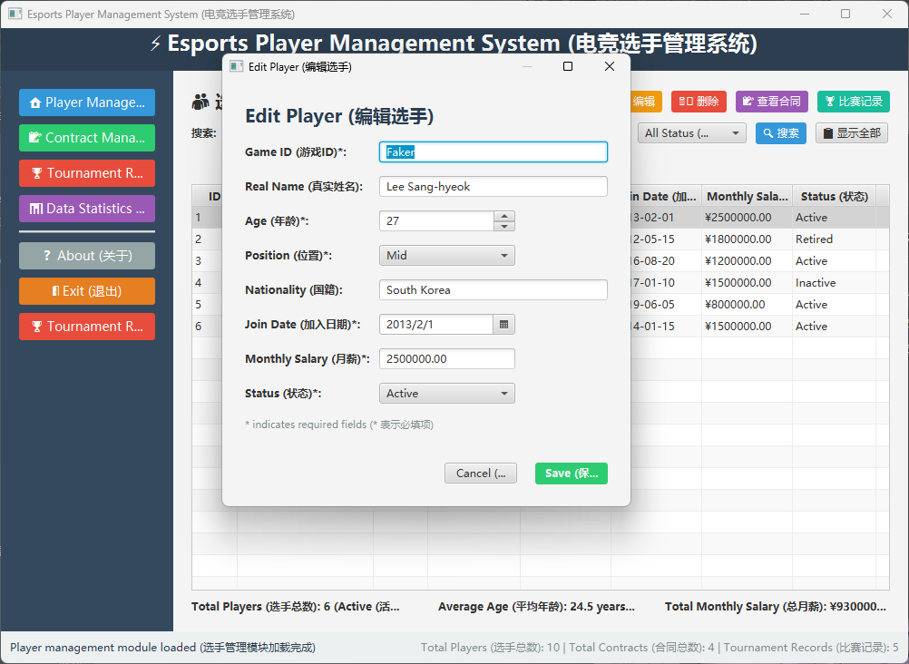
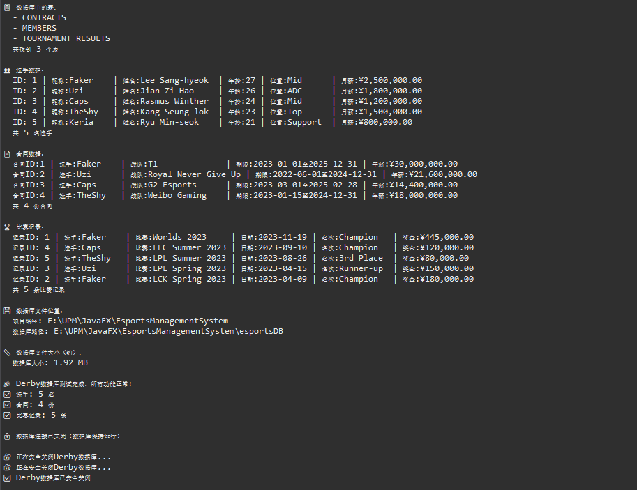
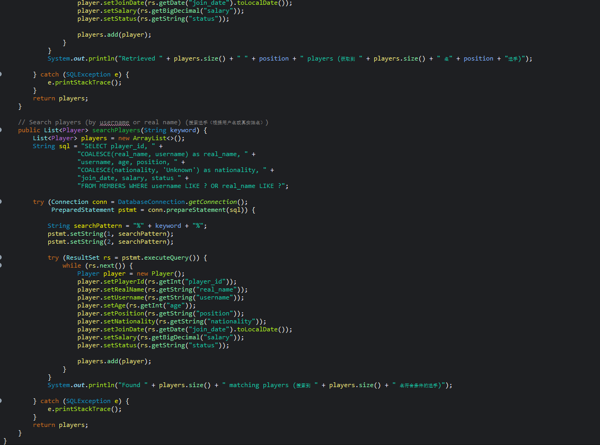

# Esports Team Management

JavaFX + MySQL desktop app for esports team ops — players, contracts, and tournament results in one place.

**Portfolio:** https://hawk327ml.github.io/  
**Repo:** https://github.com/Hawk327ml/esports-team-management

Desktop-only (no public Live URL). Screenshots below show the three main tabs.

## What it does

- **Players / members** — roster CRUD (role, nationality, salary, status)
- **Contracts** — link players to team deals and salary terms
- **Tournament results** — ranking, prize money, team context per event

Built as a course / lab-style ops desk: FXML UI → controllers → DAO → MySQL.

## Preview







More captures: [`docs/screenshots/`](docs/screenshots/).

## Stack

| Layer | Tech |
|-------|------|
| UI | JavaFX 21 + FXML |
| Language | Java 17 |
| Build | Maven (`javafx-maven-plugin`) |
| DB | MySQL 8+ (`esports_manager`) |

## Quick start

1. Install **JDK 17+**, **Maven**, and **MySQL**.
2. Create schema (+ optional demo rows):

```bash
mysql -u root -p < sql/schema.sql
mysql -u root -p < sql/seed_demo.sql
```

3. Set DB password (do **not** commit secrets):

```powershell
$env:ESPORTS_DB_PASSWORD = "your_password"
# optional:
# $env:ESPORTS_DB_USER = "root"
# $env:ESPORTS_DB_URL  = "jdbc:mysql://localhost:3306/esports_manager"
```

4. Run:

```powershell
.\run.bat
```

or:

```bash
mvn clean javafx:run
```

Main class: `com.esports.main.EsportsApp`

## Configuration

Defaults in `DatabaseConnection.java` (overridable via env):

| Env | Default |
|-----|---------|
| `ESPORTS_DB_URL` | `jdbc:mysql://localhost:3306/esports_manager` |
| `ESPORTS_DB_USER` | `root` |
| `ESPORTS_DB_PASSWORD` | `changeme` (local fallback only) |
| `ESPORTS_DB_VERBOSE` | unset — set `1` for connection debug logs |

## Layout

```text
pom.xml / run.bat
sql/schema.sql
sql/seed_demo.sql
src/com/esports/
  main/          # EsportsApp + DAO smoke tests
  controller/
  dao/           # MEMBERS / CONTRACTS / TOURNAMENT_RESULTS
  model/
  view/          # FXML
  util/
docs/preview/    # README screenshots
docs/screenshots/
```

## Security

Local MySQL credentials were redacted before publish. Prefer `ESPORTS_DB_PASSWORD` over the local fallback. Rotate any password that appeared in older drafts.
